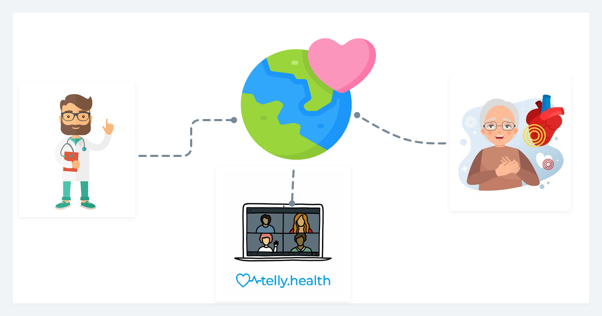
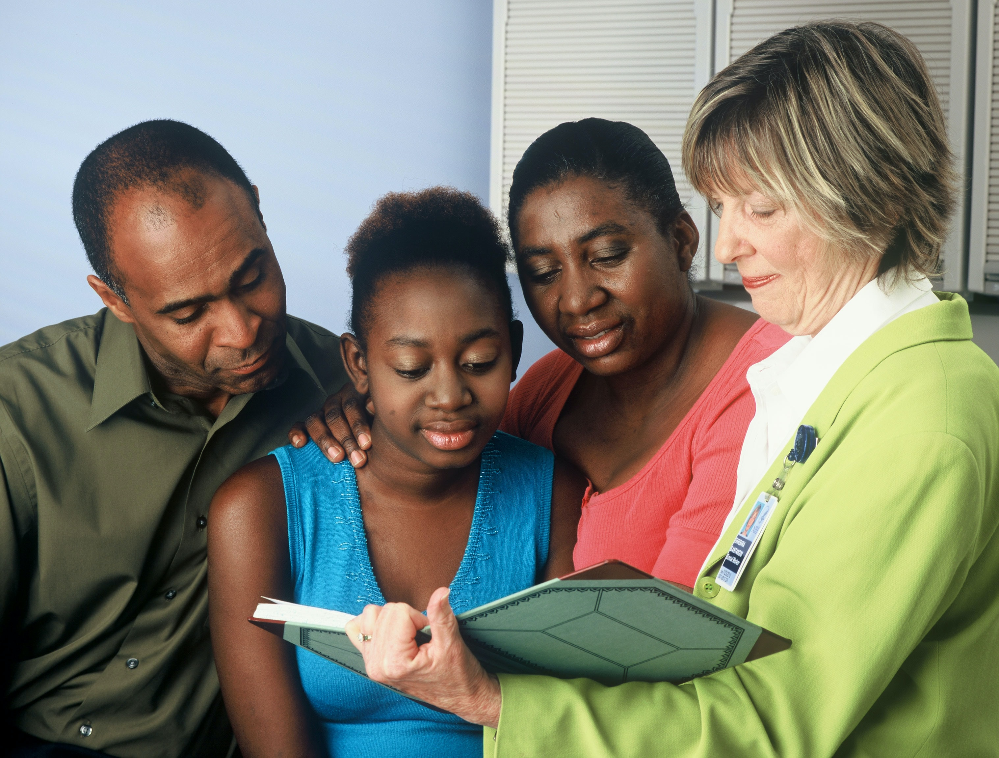
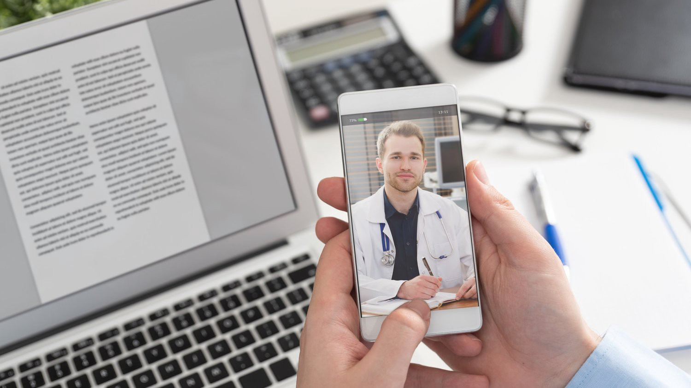

### Right now, the situation in Asia Pacific is dire, with millions of new COVID-19 cases being reported daily.

Families are losing loved ones, there is a critical shortage of oxygen and the country’s healthcare system is at breaking point.

The Covid-19 pandemic has added additional stress for an overburdened healthcare workforce. 

The worldwide telehealth solution is sorely in need of impacted country at the moment of crisis. This would enable global shared healthcare support for people across the globe. 

As lockdown measures have strictened across the Asia Pacific countries, people have no access to bare minimum medical consultation for any illness.

Our vision is to make health professionals accessible to everyone across the globe through telehealth consultations.

`telly.health` vision is to enable healthcare professionals across the globe to create telehealth webinar, group consultation and one-to-one consultation for people in need through our platform which could simultaneously save time and support people during crisis.

### What is a telehealth webinar?

Telehealth webinar is an online meeting or presentation held by health professional to share vital information.

The main feature of live webinars is interactivity, or the ability to discuss, send and receive information in real-time.

### How does it work? 

First, you need to schedule the event. It’s easy: just create an account on the platform and use the dashboard to set the event’s date, time and duration.

Once the webinar is created then invitation link published in the platform. 

Participants watch, listen, and communicate with one another and with you via the chat.

At the end of the session, event recording is sent to all participants just in case someone was late or missed the online meeting.

### What are group telehealth consultation?

Group tele consultations are a sustainable alternative to current primary care practice of seeing people one to one. They make it possible for the practice team to support people in the way they want AND simultaneously reduce clinician workload, thus creating access and continuity of care for patients. 

### How does it work? 

Group consultations are led by a medical practitoner. The clinician creates a group consultation to invite people with similar condition.

Prior to the joining the group consultation, people should have provided the health tests report if neccessary, so clinican can assist based on ‘their numbers’ e.g. Hba1c, cholesterol.

The clinician joins 20 – 30 minutes prior to the session to review the people's reports and queries.

The clinician then holds brief 1:1 consultations with each of the participants in the group setting. They usually raise no more than one or two questions. This session lasts for allocated 45-60 minutes. Everyone listens and learns from the conversation and advice given to everyone in the group.

### What is one-to-one telehealth consultation?

One-to-one telehealth service allows patients to have a video consultation with a registered doctor on the platform.

### How does it work?

Patient can request an appointment with available GP/specialist. 

Once practitioner accepts the request, you will be sent an email or SMS with a link to the session.

### We need your support

We are in need of medical practitoners across the globe to participate and support us. 

